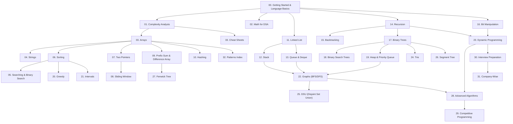

# DSA Topic Dependency Graph & Learning Order (`TOPIC_DEPENDENCY.md`)

Strict compliance with Rule R9: **Prerequisites First**. A concept may never be used before the topic that teaches it unless explicitly linked as a prerequisite.

## 1. Topological Prerequisite Ordering

---

## 2. Topic Dependency Matrix

| Topic | Strict Prerequisites | Concepts Unlocked Next | Pedagogical Rationale |
|---|---|---|---|
| **00. Getting Started** | None | All Topics | Establishes language syntax, environment, variables, loops, functions, memory model. |
| **01. Complexity Analysis** | 00 | All Algorithms | Big-O notation is required to evaluate every subsequent algorithm. |
| **02. Math for DSA** | 00 | 03, 16, 29 | Modular arithmetic, GCD/LCM, fast power are used across arrays, bitwise and CP. |
| **03. Arrays** | 00, 01 | 04, 05, 06, 07, 08, 09, 10 | The fundamental contiguous data structure for all pointer and window techniques. |
| **04. Strings** | 03 | 07, 08, 10, 24, 28 | Strings are character arrays; unlocks string pattern matching and hashing. |
| **05. Searching** | 03, 06 | 18, 23 | Binary search requires sorted data; unlocks BS on Answer and BST. |
| **06. Sorting** | 03 | 05, 07, 20, 21 | Sorting is an essential prerequisite for two pointers, greedy, and intervals. |
| **07. Two Pointers** | 03, 06 | 08, 11 | Opposite-direction and same-direction pointers; foundation for sliding window. |
| **08. Sliding Window** | 03, 07, 10 | 13 | Subarray optimization with frequency maps and monotonic deques. |
| **09. Prefix Sum & Diff Array**| 03 | 27 | Range sum queries in $O(1)$ and range updates; leads directly to Fenwick Tree. |
| **10. Hashing** | 03 | 04, 08, 11, 22 | Key-value mapping in average $O(1)$; used universally across all interview questions. |
| **11. Linked List** | 00, 01 | 12, 13, 24 | Dynamic pointer-based structures; foundation for node manipulations, stacks, and queues. |
| **12. Stack** | 11 | 22 (DFS), Monotonic | LIFO structure; unlocks recursion simulation, DFS, monotonic stacks. |
| **13. Queue & Deque** | 11 | 22 (BFS), 08 | FIFO structure; essential for graph BFS and sliding window maximum. |
| **14. Recursion** | 00, 01 | 15, 17, 23 | Self-referential functions; prerequisite for backtracking, trees, and DP. |
| **15. Backtracking** | 14 | 22, 23 | Systematic state-space tree traversal; choice, exploration, and pruning. |
| **16. Bit Manipulation** | 00, 02 | 23 (Bitmask DP) | Binary operations, bit masks, subset representations. |
| **17. Binary Trees** | 14, 11 | 18, 19, 24, 26 | Hierarchical recursive structure; tree traversals, depth, and structural proofs. |
| **18. BST** | 17, 05 | 19, 26 | Binary search invariant applied to trees; fast search, insertion, and deletion. |
| **19. Heap & Priority Queue** | 17, 03 | 20, 22 (Dijkstra) | Complete binary tree in an array; priority scheduling and shortest paths. |
| **20. Greedy** | 06 | 21, 22 (MST) | Locally optimal choices; activity selection, Huffman coding, Dijkstra, Prim. |
| **21. Intervals** | 06, 03 | 20, 23 | Interval overlapping, merging, insertion, and scheduling. |
| **22. Graphs** | 12, 13, 19 | 25, 27, 28 | Adjacency representation, BFS, DFS, Dijkstra, Bellman-Ford, Floyd-Warshall. |
| **23. Dynamic Programming** | 14, 16, 03 | 28, 29 | Optimal substructure + overlapping subproblems; 1D, 2D, knapsack, LCS, LIS. |
| **24. Trie** | 17, 04 | 28 | Prefix tree for efficient string dictionary searches and bitwise XOR queries. |
| **25. DSU** | 22 | 22 (Kruskal) | Disjoint-set forest with near-$O(1)$ operations via path compression + union by rank. |
| **26. Segment Tree** | 17, 09 | 28, 29 | Range query and update tree with lazy propagation. |
| **27. Fenwick Tree** | 09, 16 | 28, 29 | Binary indexed tree for prefix sums and point updates. |
| **28. Advanced Algorithms** | 22, 23, 24 | 29 | Tarjan SCC, Bridges, KMP, Z-algorithm, LCA via binary lifting. |
| **29. Competitive Programming**| All above | Contests | Fast I/O, contest templates, time limits, stress testing. |
| **30. Interview Preparation** | All above | Interviews | 4/8/12-week study plans, mock checklist, behavioral + technical prep. |
| **31. Company-Wise** | 30 | Target Prep | Curated practice problem sets tagged by verified company asking history. |
| **32. Patterns Index** | All above | Quick Lookup | Pattern-first index linking to canonical problem files. |
| **33. Cheat Sheets** | All above | Revision | Concise, high-density quick revision summaries. |